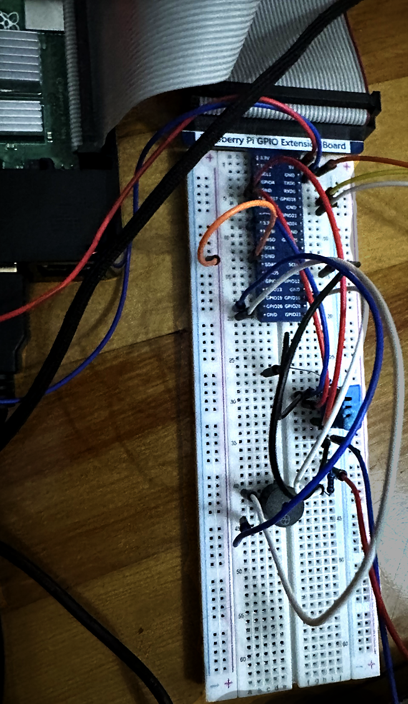

# Smart Door System (IoT) — React • Firebase • Raspberry Pi

A smart door IoT system combining **React**, **Firebase Realtime Database**, and **Raspberry Pi (Python)**.  
It operates in **automatic** and **manual** modes, managing real hardware: temperature sensor, alarm buzzer, LED indicator, and servo-controlled door.

---

## Overview

The system links a **Raspberry Pi** running Python scripts to a **React web dashboard** via **Firebase Realtime Database**.  
The Pi updates sensor data and receives control commands through Firebase, while the web interface displays real-time data and can manually override controls.

---

## Live Demo

Web App: https://incendie-kappa.vercel.app/
Repository: https://github.com/DenisJuc/Incendie

---

## Modes of Operation

### Automatic Mode
- Raspberry Pi reads actual sensor data and controls hardware:
  - **Temperature Sensor:** triggers when temperature exceeds a set threshold.
  - **Alarm:** activates when overheated.
  - **LED:** illuminates above the door during alert state.
  - **Door Servo:** opens automatically during high temperature; closes when normalized.
- Python sends all readings to Firebase.
- The React dashboard **polls Firebase every 10 seconds** to refresh live status.

### Manual Mode
- The web UI takes control and **writes values directly** to Firebase.
- Raspberry Pi temporarily **pauses live sensor reading**.
- Users can toggle:
  - Door open/close  
  - Alarm on/off  
  - LED indicator  
- When switched back to automatic mode, the Pi regains full control.

---

## System Architecture

Raspberry Pi (Python)
⇅
Firebase Realtime Database
⇅
React Web Dashboard (Vercel)


**Data flow:**
- Automatic mode → Pi → Firebase → UI  
- Manual mode → UI → Firebase → Pi  

---

## Tech Stack

| Layer | Technology |
|-------|-------------|
| Front-End | React (JavaScript, HTML, CSS) |
| Back-End / Data | Firebase Realtime Database |
| Hardware | Raspberry Pi, Temperature Sensor, LED, Alarm, Servo Motor |
| Deployment | Vercel (Frontend Hosting) |
| Language | Python (for hardware control scripts) |

---

## Prototype

<p align="center">
  
</p>

---

## Setup

### Frontend (React UI)
```bash
npm install
npm start
```
## Raspberry Pi (Python)
pip install firebase-admin gpiozero python main.py

Note: The Firebase API key is public intentionally — this is a school project and does not contain sensitive data.
